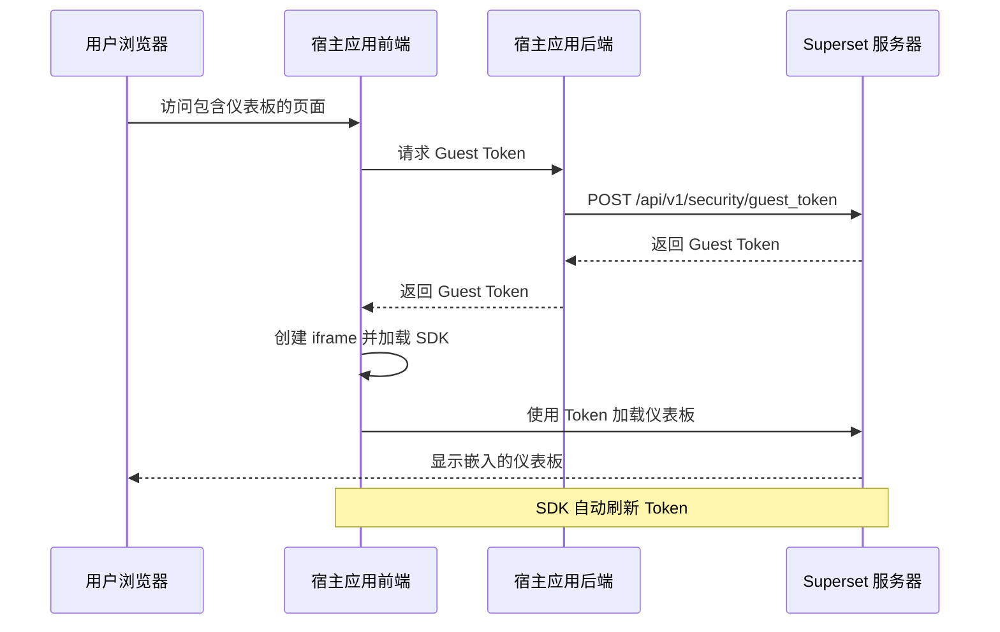

# Superset 嵌入式仪表板完整集成指南

## 目录
1. [概述](#概述)
2. [工作原理](#工作原理)
3. [Superset 端配置](#superset-端配置)
4. [外部系统后端实现](#外部系统后端实现)
5. [外部系统前端实现](#外部系统前端实现)
6. [安全注意事项](#安全注意事项)
7. [常见问题](#常见问题)

## 概述

Superset Embedded SDK 允许您将 Superset 仪表板无缝嵌入到自己的应用程序中，使用您应用程序的身份验证系统，而无需用户直接登录 Superset。

### 核心特性
- 🔐 **安全隔离**：通过 iframe 和 Guest Token 机制确保安全
- 🎨 **可定制 UI**：可以隐藏/显示特定的 UI 元素
- 🔄 **自动刷新**：Token 自动刷新，无需手动管理
- 📊 **行级安全**：支持 RLS（Row Level Security）数据过滤
- 📱 **响应式设计**：自适应不同屏幕尺寸

## 工作原理



## Superset 端配置

### 1. 启用嵌入功能

#### 方法 A：修改配置文件
```python
# superset/config.py 或 docker/pythonpath_dev/superset_config.py

# 启用嵌入功能
FEATURE_FLAGS = {
    "EMBEDDED_SUPERSET": True,
}

# 配置 Guest Token（生产环境必须修改！）
GUEST_TOKEN_JWT_SECRET = "your-very-strong-secret-key-change-me"  # 至少 32 个字符
GUEST_TOKEN_JWT_ALGO = "HS256"
GUEST_TOKEN_HEADER_NAME = "X-GuestToken"

# Guest 用户默认角色
GUEST_ROLE_NAME = "Public"

# 可选：Token 验证钩子
def guest_token_validator(token_payload):
    """自定义 Token 验证逻辑"""
    # 例如：检查用户组织、IP 地址等
    return True

GUEST_TOKEN_VALIDATOR_HOOK = guest_token_validator
```

#### 方法 B：Docker 环境变量
```bash
# docker/.env
SUPERSET_FEATURE_EMBEDDED_SUPERSET=true
```

### 2. 配置仪表板为可嵌入

1. 登录 Superset 管理界面
2. 进入目标仪表板
3. 点击右上角的三点菜单 (⋮)
4. 选择 "Embed dashboard"（嵌入仪表板）
5. 在弹出的配置窗口中：
   - 设置允许的域名（Allowed Domains），留空表示允许所有域名
   - 点击 "SAVE" 保存配置
6. 保存后会生成仪表板的嵌入 UUID

### 3. 配置权限

确保 Guest 角色（默认为 "Public"）有适当的权限：
- `can_read` on Dashboard
- `can_read` on Chart
- `can_read` on Dataset
- `datasource_access` on 相关数据源

## 外部系统后端实现

### 1. 方法一：调用 Superset API（推荐）

#### Python 示例
```python
import requests
from flask import Flask, jsonify, request
from flask_cors import CORS

app = Flask(__name__)
CORS(app)

SUPERSET_URL = "https://your-superset.example.com"
SUPERSET_API_TOKEN = "your-admin-api-token"  # 需要 can_grant_guest_token 权限

@app.route('/api/guest-token', methods=['GET'])
def get_guest_token():
    """
    为当前用户生成 Superset Guest Token
    """
    # 从您的认证系统获取当前用户信息
    current_user = get_current_user()  # 您的认证逻辑
    
    # 构建请求负载
    payload = {
        "user": {
            "username": current_user.email,
            "first_name": current_user.first_name,
            "last_name": current_user.last_name
        },
        "resources": [{
            "type": "dashboard",
            "id": request.args.get('dashboard_id')  # 前端传来的仪表板 ID
        }],
        "rls": []  # 行级安全规则（见下文）
    }
    
    # 可选：添加行级安全规则
    if current_user.department:
        payload["rls"].append({
            "clause": f"department = '{current_user.department}'"
        })
    
    # 调用 Superset API
    headers = {
        "Authorization": f"Bearer {SUPERSET_API_TOKEN}",
        "Content-Type": "application/json"
    }
    
    response = requests.post(
        f"{SUPERSET_URL}/api/v1/security/guest_token",
        json=payload,
        headers=headers
    )
    
    if response.status_code == 200:
        return jsonify({"token": response.json()["token"]})
    else:
        return jsonify({"error": "Failed to get guest token"}), 500
```

#### Node.js 示例
```javascript
const express = require('express');
const axios = require('axios');
const app = express();

const SUPERSET_URL = 'https://your-superset.example.com';
const SUPERSET_API_TOKEN = 'your-admin-api-token';

app.get('/api/guest-token', async (req, res) => {
    // 获取当前用户信息
    const currentUser = req.user; // 从您的认证中间件获取
    
    const payload = {
        user: {
            username: currentUser.email,
            first_name: currentUser.firstName,
            last_name: currentUser.lastName
        },
        resources: [{
            type: 'dashboard',
            id: req.query.dashboard_id
        }],
        rls: []
    };
    
    // 添加 RLS 规则
    if (currentUser.department) {
        payload.rls.push({
            clause: `department = '${currentUser.department}'`
        });
    }
    
    try {
        const response = await axios.post(
            `${SUPERSET_URL}/api/v1/security/guest_token`,
            payload,
            {
                headers: {
                    'Authorization': `Bearer ${SUPERSET_API_TOKEN}`,
                    'Content-Type': 'application/json'
                }
            }
        );
        
        res.json({ token: response.data.token });
    } catch (error) {
        res.status(500).json({ error: 'Failed to get guest token' });
    }
});
```

### 2. 方法二：直接生成 JWT Token

如果您有 `GUEST_TOKEN_JWT_SECRET`，可以直接生成 Token：

```python
import jwt
from datetime import datetime, timedelta

def generate_guest_token(user_info, dashboard_id):
    """
    直接生成 Guest Token（需要知道密钥）
    """
    payload = {
        "user": {
            "username": user_info["email"],
            "first_name": user_info["first_name"],
            "last_name": user_info["last_name"]
        },
        "resources": [{
            "type": "dashboard",
            "id": dashboard_id
        }],
        "rls_rules": [],
        "iat": datetime.utcnow(),
        "exp": datetime.utcnow() + timedelta(minutes=5),  # 5分钟过期
        "aud": "superset",
        "type": "guest"
    }
    
    token = jwt.encode(
        payload,
        "your-very-strong-secret-key-change-me",  # 必须与 GUEST_TOKEN_JWT_SECRET 一致
        algorithm="HS256"
    )
    
    return token
```

## 外部系统前端实现

### 1. 安装 SDK

```bash
# 使用 npm
npm install --save @superset-ui/embedded-sdk

# 使用 yarn
yarn add @superset-ui/embedded-sdk

# 使用 pnpm
pnpm add @superset-ui/embedded-sdk
```

### 2. React 集成示例

```jsx
import React, { useEffect, useRef } from 'react';
import { embedDashboard } from '@superset-ui/embedded-sdk';

function SupersetDashboard({ dashboardId }) {
    const mountPoint = useRef(null);
    const dashboardRef = useRef(null);
    
    useEffect(() => {
        const embed = async () => {
            // 清理之前的实例
            if (dashboardRef.current) {
                dashboardRef.current.unmount();
            }
            
            // 嵌入新的仪表板
            dashboardRef.current = await embedDashboard({
                id: dashboardId,
                supersetDomain: 'https://your-superset.example.com',
                mountPoint: mountPoint.current,
                
                // 从后端获取 Guest Token
                fetchGuestToken: async () => {
                    const response = await fetch(`/api/guest-token?dashboard_id=${dashboardId}`, {
                        credentials: 'include'  // 包含 cookies
                    });
                    const data = await response.json();
                    return data.token;
                },
                
                // UI 配置
                dashboardUiConfig: {
                    hideTitle: false,        // 显示标题
                    hideTab: false,          // 显示标签页
                    hideChartControls: false, // 显示图表控制
                    filters: {
                        visible: true,       // 显示过滤器
                        expanded: false      // 默认收起过滤器
                    },
                    urlParams: {            // 传递 URL 参数
                        show_filters: '1',
                        native_filters: '1'
                    }
                },
                
                // 调试模式
                debug: process.env.NODE_ENV === 'development',
                
                // iframe 属性
                iframeTitle: '数据仪表板',
                iframeSandboxExtras: [
                    'allow-top-navigation',
                    'allow-popups-to-escape-sandbox'
                ]
            });
            
            // 可选：与仪表板交互
            try {
                // 获取滚动尺寸
                const size = await dashboardRef.current.getScrollSize();
                console.log('Dashboard size:', size);
                
                // 获取永久链接
                const permalink = await dashboardRef.current.getDashboardPermalink('tab1');
                console.log('Permalink:', permalink);
                
                // 获取活动标签
                const tabs = await dashboardRef.current.getActiveTabs();
                console.log('Active tabs:', tabs);
            } catch (error) {
                console.error('Dashboard interaction error:', error);
            }
        };
        
        if (mountPoint.current) {
            embed();
        }
        
        // 清理函数
        return () => {
            if (dashboardRef.current) {
                dashboardRef.current.unmount();
            }
        };
    }, [dashboardId]);
    
    return (
        <div style={{ width: '100%', height: '800px' }}>
            <div ref={mountPoint} style={{ width: '100%', height: '100%' }} />
        </div>
    );
}

export default SupersetDashboard;
```

### 3. Vue 集成示例

```vue
<template>
  <div class="superset-dashboard">
    <div ref="dashboardContainer" class="dashboard-container"></div>
  </div>
</template>

<script>
import { embedDashboard } from '@superset-ui/embedded-sdk';

export default {
  name: 'SupersetDashboard',
  props: {
    dashboardId: {
      type: String,
      required: true
    }
  },
  data() {
    return {
      dashboard: null
    };
  },
  mounted() {
    this.embedDashboard();
  },
  beforeUnmount() {
    if (this.dashboard) {
      this.dashboard.unmount();
    }
  },
  methods: {
    async embedDashboard() {
      this.dashboard = await embedDashboard({
        id: this.dashboardId,
        supersetDomain: 'https://your-superset.example.com',
        mountPoint: this.$refs.dashboardContainer,
        fetchGuestToken: async () => {
          const response = await fetch(`/api/guest-token?dashboard_id=${this.dashboardId}`);
          const data = await response.json();
          return data.token;
        },
        dashboardUiConfig: {
          hideTitle: false,
          filters: {
            visible: true,
            expanded: false
          }
        }
      });
    }
  }
};
</script>

<style scoped>
.dashboard-container {
  width: 100%;
  height: 800px;
}
</style>
```

### 4. 原生 HTML/JavaScript 示例

```html
<!DOCTYPE html>
<html>
<head>
    <title>嵌入式 Superset 仪表板</title>
    <script src="https://unpkg.com/@superset-ui/embedded-sdk@latest"></script>
    <style>
        #dashboard-container {
            width: 100%;
            height: 800px;
            border: 1px solid #ccc;
        }
    </style>
</head>
<body>
    <h1>数据分析仪表板</h1>
    <div id="dashboard-container"></div>
    
    <script>
        // 配置参数
        const DASHBOARD_ID = 'your-dashboard-uuid';
        const SUPERSET_DOMAIN = 'https://your-superset.example.com';
        
        // 嵌入仪表板
        async function initDashboard() {
            const dashboard = await supersetEmbeddedSdk.embedDashboard({
                id: DASHBOARD_ID,
                supersetDomain: SUPERSET_DOMAIN,
                mountPoint: document.getElementById('dashboard-container'),
                
                // 获取 Guest Token
                fetchGuestToken: async () => {
                    const response = await fetch(`/api/guest-token?dashboard_id=${DASHBOARD_ID}`);
                    const data = await response.json();
                    return data.token;
                },
                
                // UI 配置
                dashboardUiConfig: {
                    hideTitle: false,
                    hideTab: false,
                    hideChartControls: false,
                    filters: {
                        visible: true,
                        expanded: false
                    }
                },
                
                // iframe 沙箱属性
                iframeSandboxExtras: ['allow-downloads']
            });
            
            // 响应式调整高度
            window.addEventListener('resize', async () => {
                const size = await dashboard.getScrollSize();
                document.getElementById('dashboard-container').style.height = size.height + 'px';
            });
        }
        
        // 页面加载完成后初始化
        document.addEventListener('DOMContentLoaded', initDashboard);
    </script>
</body>
</html>
```

## 安全注意事项

### 1. Token 安全
- **生产环境必须修改** `GUEST_TOKEN_JWT_SECRET`
- 使用至少 32 个字符的强密钥
- 定期轮换密钥
- 不要在前端代码中暴露密钥

### 2. 权限控制
- 仅授予必要的最小权限
- 使用 RLS 限制数据访问
- 验证用户身份后才生成 Token
- 限制 Token 的有效期（建议 5-15 分钟）

### 3. 网络安全
- 使用 HTTPS 传输
- 配置 CORS 策略
- 使用 CSP（Content Security Policy）
- 监控异常访问

### 4. iframe 沙箱
SDK 默认启用以下沙箱属性：
- `allow-same-origin`：允许同源访问
- `allow-scripts`：允许执行脚本
- `allow-presentation`：允许全屏
- `allow-downloads`：允许下载
- `allow-forms`：允许表单提交
- `allow-popups`：允许弹窗（导出功能）

谨慎添加额外的沙箱权限。

## 常见问题

### Q1: 仪表板显示 "Unauthorized" 错误
**原因**：Guest Token 无效或过期
**解决**：
1. 检查 `EMBEDDED_SUPERSET` 是否启用
2. 验证 `GUEST_TOKEN_JWT_SECRET` 是否正确
3. 确认 Token 未过期
4. 检查仪表板是否已启用嵌入

### Q2: 跨域错误（CORS）
**原因**：Superset 和宿主应用不在同一域
**解决**：
```python
# superset_config.py
CORS_OPTIONS = {
    "supports_credentials": True,
    "allow_headers": ["*"],
    "resources": ["*"],
    "origins": ["https://your-app.example.com"]
}
```

### Q3: 过滤器不工作
**原因**：URL 参数或配置不正确
**解决**：
```javascript
dashboardUiConfig: {
    filters: {
        visible: true,
        expanded: true
    },
    urlParams: {
        preselect_filters: '{"1": {"column": "value"}}'
    }
}
```

### Q4: Token 刷新问题
**原因**：Token 过期时间设置不当
**解决**：
- SDK 会在 Token 过期前 5 秒自动刷新
- 确保后端 API 支持频繁的 Token 请求
- Token 有效期建议设置为 5-15 分钟

### Q5: 性能优化
**建议**：
1. 使用 CDN 加载 SDK
2. 懒加载仪表板
3. 合理设置 Token 缓存
4. 优化仪表板查询

## UI 配置参数详解

### dashboardUiConfig 选项

| 参数 | 类型 | 默认值 | 说明 |
|------|------|--------|------|
| `hideTitle` | boolean | false | 隐藏仪表板标题 |
| `hideTab` | boolean | false | 隐藏标签页 |
| `hideChartControls` | boolean | false | 隐藏图表控制按钮 |
| `filters.visible` | boolean | true | 显示过滤器面板 |
| `filters.expanded` | boolean | false | 默认展开过滤器 |
| `urlParams` | object | {} | 传递给仪表板的 URL 参数 |

### 配置值计算
SDK 内部使用位运算计算配置值：
- hideTitle: +1
- hideTab: +2
- hideChartControls: +8

## 总结

Superset Embedded SDK 提供了一个强大而灵活的方案，让您可以将 Superset 的数据可视化能力无缝集成到自己的应用中。通过 Guest Token 机制和 iframe 隔离，既保证了安全性，又提供了良好的用户体验。

关键要点：
1. **Guest Token 是核心**：所有认证都通过 Token 实现
2. **自动刷新机制**：SDK 自动管理 Token 生命周期
3. **灵活的 UI 配置**：可以根据需求定制显示
4. **安全第一**：多层安全机制保护数据
5. **跨框架支持**：React、Vue、原生 JS 都可使用

## 相关资源

- [Superset 官方文档](https://superset.apache.org/docs/intro)
- [Embedded SDK NPM 包](https://www.npmjs.com/package/@superset-ui/embedded-sdk)
- [Superset GitHub](https://github.com/apache/superset)
- [示例项目](https://github.com/apache/superset/tree/master/superset-embedded-sdk)